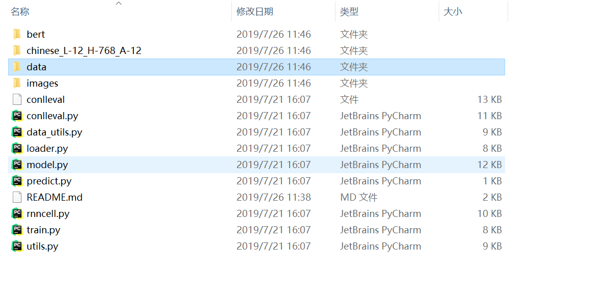

# *Bert-NER*

### *Introduction*

该项目是基于谷歌开源的BERT预训练模型，在中文NER任务上进行[fine-tune](https://github.com/binhaowang/Bert-NER/blob/master/BERT%20fine-tune%E5%AE%9E%E8%B7%B5.md)。

### *Datasets & Model*

预训练的中文BERT模型及代码来自于Google Research的[bert](https://github.com/google-research/bert)。

### *Results*

引入bert之后，可以看到在验证集上的F-1值在训练了16个epoch时就已经达到了**94.87**，并在测试集上达到了**93.68**，在这个数据集上的F-1值提升了两个多百分点。

### *Train*

1. 下载[bert模型代码](https://github.com/google-research/bert)，放入本项目根目录
2. 下载[bert的中文预训练模型](https://storage.googleapis.com/bert_models/2018_11_03/chinese_L-12_H-768_A-12.zip)，解压放入本项目根目录
3. 搭建依赖环境python3 + tensorflow >= 1.12
4. 执行`python train.py`即可训练模型
5. 执行`python predict.py`可以对单句进行测试

整理后的项目目录，应如图所示。

### *Conclusion*

可以看到，使用bert以后，模型的精度提升了两个多百分点。并且，在后续测试过程中发现，使用bert训练的NER模型拥有更强的泛化性能，比如训练集中未见过的公司名称等，都可以很好的识别, 基本上解决OOV问题。

